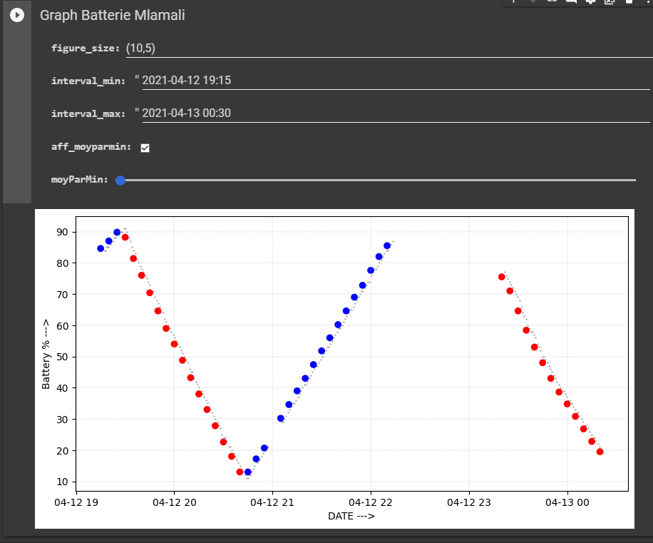

# Battery Analysis
Programme qui enregistre les informations de la batterie. De surcroit, le programme vous notifie de débrancher le chargeur de votre PC lorsque votre batterie est chargé à plus de 95%.

### ⚙ How to run it
Ouvrir var.txt puis rentrer la durée maximal d'execution et le delai entre les points voulus.   
Executer Run.py pour commencer l'enregistrement.   
Les points seront enregistrés dans un fichier csv.

### The story of the code

Mon nouveau pc a perdu de ouf en autonomie de batterie. Je sais déjà que c'est dû au fait que je l'utilise comme si c'était un pc fixe, h24 branché au secteur, alors que je sais très bien que ça bz la batterie.

Pourquoi j'ai fait ça ? Jsais mm pas, j'aime bien les graphiques.

### 📸 Screenshots 

---
[Mlamali SAID SALIMO](https://www.linkedin.com/in/mlamalisaidsalimo)   
